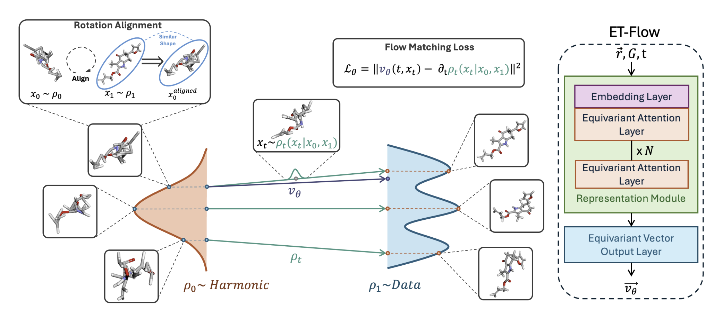

<div align="center">

# ET-Flow
<a href="https://pytorch.org/get-started/locally/"></a>
<a href="https://pytorchlightning.ai/"></a><br>
[](https://neurips.cc/virtual/2024/poster/94522)
[](https://doi.org/10.48550/arXiv.2410.22388)
<br>
[](https://zenodo.org/records/14226681)


</div>

Implementation of [Equivariant Flow Matching for Molecule Conformer Generation](https://arxiv.org/abs/2410.22388) by M Hassan, N Shenoy, J Lee, H Stark, S Thaler and D Beaini.

ET-Flow is a state-of-the-art generative model for generating small molecule conformations using equivariant transformers and flow matching.

### Install ET-Flow
We are now available on PyPI. Easily install the package using the following command:
```bash
pip install etflow
```

### Generating Conformations for Custom Smiles
**Option 1**: Load the model config and checkpoint with automatic download and caching. See ([tutorial.ipynb](tutorial.ipynb)) or use the following snippet to load the model and generate conformations for custom smiles input.

```python
from etflow import BaseFlow
model = BaseFlow.from_default(model="drugs-o3")

# prediction 3 conformations for one molecule given by smiles
smiles = 'CN1C=NC2=C1C(=O)N(C(=O)N2C)C'
output = model.predict([smiles], num_samples=3, as_mol=True)
mol = output[smiles] # rdkit mol object

# if we want just positions as numpy array
output = model.predict([smiles], num_samples=3)
output[smiles] # np.ndarray with shape (num_samples, num_atoms, 3)

# for prediction on more than 1 smiles
smiles_1 = ...
smiles_2 = ...
output = model.predict([smiles_1, smiles_2], num_samples=3, as_mol=True)
```

We currently support the following configurations and checkpoint:
- `drugs-o3`
- `qm9-o3`
- `drugs-so3`

**Option 2**: Load the model config, download checkpoints from the following zenodo [link](https://zenodo.org/records/14226681) and load it manually into the model config. We have a sample notebook ([generate_confs.ipynb](generate_confs.ipynb)) to generate conformations for custom smiles input. One needs to pass the config and corresponding checkpoint path in order as additional inputs.

### Setup Dev Environment
Run the following commands to setup the environment:
```bash
conda env create -n etflow -f env.yml
conda activate etflow
# to install the etflow package
python3 -m pip install -e .
```


### Preprocessing Data
To pre-process the data, perform the following steps,
1. Download the raw GEOM data and unzip the raw data using the following commands,

```bash
wget https://dataverse.harvard.edu/api/access/datafile/4327252 -O <output_folder_path/rdkit_folder.tar>
tar -zxvf <output_folder_path/rdkit_folder.tar>
```

2. Process the data for `ET-Flow` training. First, set the `DATA_DIR` environment variable. All preprocessed data will be created inside this.

```bash
export DATA_DIR=</path_to_data>
python scripts/prepare_data.py -p /path/to/geom/rdkit-raw-folder
```

3. Download the splits from the [zenodo link](`https://zenodo.org/records/13870058`). Once these files are downloaded, extract the zip files to the respective folders inside `$DATA_DIR`,

```bash
unzip QM9.zip -d $DATA_DIR
unzip DRUGS.zip -d $DATA_DIR
```

### Training
We provide our configs for training on the GEOM-DRUGS and the GEOM-QM9 datasets in various configurations. Run the following commands once datasets are preprocessed and the environment is set up:

```bash
python etflow/train.py -c configs/drugs-base.yaml
```

The following two configs from the `configs/` directory can be used for replicating paper results:
- `drugs-base.yaml`: ET-Flow trained on GEOM-DRUGS dataset
- `qm9-base.yaml`: ET-Flow trained on GEOM-QM9 dataset

### Evaluation
Before running eval with any checkpoint, create an evaluation csv (will be saved at `$DATA_DIR/processed/geom.csv`), using the following script,
```
python scripts/prepare_eval_csv.py -p /path/to/geom/rdkit-raw-folder
```

Evaluation happens in 2 steps as follows,

1. Generating Conformations
To run the evaluation on either GEOM or QM9 given a config and a checkpoint, run the following command,
```bash
# here n: number of inference steps for flow matching
python etflow/eval.py --config=<config-path> --checkpoint=<checkpoint-path> --dataset_type=qm9 --nsteps=50
```

To run the evaluation on GEOM-XL (a test-set containing much larger molecules), run the following command,
```bash
python etflow/eval_xl.py --config=<config-path> --checkpoint=<checkpoint-path> --batch_size=16 --nsteps=50
```

2. Evaluating Conformations with RMSD Metrics
The above sample generation script should created a `generated_files.pkl` at the following path, `logs/samples/<config-path>/<data-time>/flow_nsteps_{value-passed-above}/generated_files.pkl`. With the given path, we can get the various RMSD metrics using,

```bash
python etflow/eval_cov_mat.py --path=<path-to-generated-files.pkl> --num_workers=10
```

### Loading a Pre-Trained Checkpoint
Coming Soon!

### Acknowledgements
Our codebase is built using the following open-source contributions,
- [torchmd-net](https://github.com/torchmd/torchmd-net)
- [e3-diffusion-for-molecules](https://github.com/ehoogeboom/e3_diffusion_for_molecules)
- [pytorch lightning](https://lightning.ai/pytorch-lightning)

### Contact
For further questions, feel free to raise an issue.

### Citation
```
@misc{hassan2024etflow,
      title={ET-Flow: Equivariant Flow-Matching for Molecular Conformer Generation},
      author={Majdi Hassan and Nikhil Shenoy and Jungyoon Lee and Hannes Stark and Stephan Thaler and Dominique Beaini},
      year={2024},
      eprint={2410.22388},
      archivePrefix={arXiv},
      primaryClass={q-bio.QM},
      url={https://arxiv.org/abs/2410.22388},
}
```
